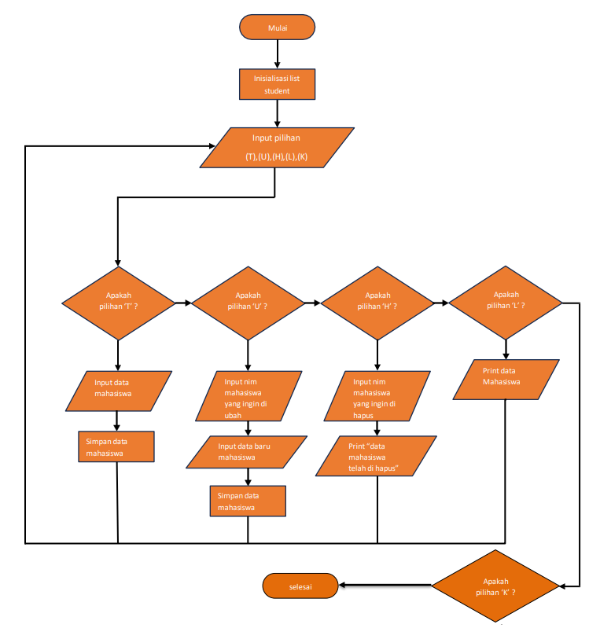

# praktikum-6
Nama: Den Fahmi Satria <p>
Nim: 312410523 <p>
Kelas: TI.24.A.5 <p>
Mata Kuliah: Pemrograman <p>
## program input nilai
berikut adalah Flowchart nya: <p>
 <p>
### dan ini adalah program python nya <p>
```
print("\nProgram Input Nilai")
print("===================")

class Student:
    def __init__(self, nim, nama, tugas, uts, uas):
        self.nim = nim
        self.nama = nama
        self.tugas = tugas
        self.uts = uts
        self.uas = uas
        self.akhir = self.calculate_final_grade()

    def calculate_final_grade(self):
        return round((self.tugas * 0.3) + (self.uts * 0.35) + (self.uas * 0.35), 2)

def display_menu():
    print("\n[(L)ihat, (T)ambah, (U)bah, (H)apus, (K)eluar]: ", end=' ')

def display_students(students):
    print("\nDaftar Nilai")
    print("=" * 84)
    print(f"| {'NO':<3} | {'NIM':<10} | {'NAMA':<30} | {'TUGAS':<6} | {'UTS':<4} | {'UAS':<4} | {'AKHIR':<5} |")
    print("=" * 84)
    if not students:
        print(f"| {'TIDAK ADA DATA':^80} |")
    else:
        for i, student in enumerate(students, start=1):
            print(f"| {i:<3} | {student.nim:<10} | {student.nama:<30} | {student.tugas:<6} | {student.uts:<4} | {student.uas:<4} | {student.akhir:<5} |")
    print("=" * 84)

def find_student_index(students, nim):
    for index, student in enumerate(students):
        if student.nim == nim:
            return index
    return None

def main():
    students = []
    while True:
        display_menu()
        choice = input().lower()
        if choice == 't':
            nim = input("\nNIM: ")
            nama = input("Nama: ")
            tugas = int(input("Nilai Tugas: "))
            uts = int(input("Nilai UTS: "))
            uas = int(input("Nilai UAS: "))
            students.append(Student(nim, nama, tugas, uts, uas))
        elif choice == 'l':
            display_students(students)
        elif choice == 'u':
            display_students(students)
            nim = input("\nMasukkan NIM mahasiswa yang akan diubah: ")
            index = find_student_index(students, nim)
            if index is not None:
                print("Data baru:")
                nama = input("Nama: ")
                tugas = int(input("Nilai Tugas: "))
                uts = int(input("Nilai UTS: "))
                uas = int(input("Nilai UAS: "))
                students[index] = Student(nim, nama, tugas, uts, uas)
            else:
                print("Mahasiswa dengan NIM tersebut tidak ditemukan.")
        elif choice == 'h':
            display_students(students)
            nim = input("\nMasukkan NIM mahasiswa yang akan dihapus: ")
            index = find_student_index(students, nim)
            if index is not None:
                del students[index]
                print("Data mahasiswa berhasil dihapus.")
            else:
                print("Mahasiswa dengan NIM tersebut tidak ditemukan.")
        elif choice == 'k':
            break
        else:
            print("Pilihan tidak valid!")

if __name__ == "__main__":
    main()
```
## Eksekusi serta penjelasan mengenai program nya <p>
 - Fungsi ```main``` adalah fungsi utama yang menjalankan program.
   - Variabel ```students``` menyimpan daftar objek ```Student```.
   - Program menampilkan menu dan menangani pilihan pengguna: <p>
      <p> 
     - **Tambah (```t```)**: Menambah data mahasiswa baru ke dalam daftar ```students```.
      
     - **Lihat (```l```)**: Menampilkan daftar mahasiswa.
     - **Ubah (```u```)**: Mengubah data mahasiswa berdasarkan Nama yang diberikan. Jika Nama ditemukan, data mahasiswa diperbarui dengan data baru.
      
     - **Hapus (```h```)**: Menghapus data mahasiswa berdasarkan Nama yang diberikan. Jika Nama ditemukan, data mahasiswa dihapus dari daftar students.
     - **Keluar (```k```)**: Keluar dari program.
